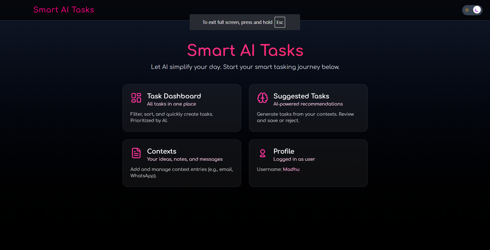

# 🧠 Smart AI Tasks API

A Django-powered backend that intelligently extracts and manages task data from user-generated contexts (emails, WhatsApp messages, notes, etc.). It uses AI to generate structured tasks, priorities, categories, and context summaries.

---

## 🚀 Live API Documentation

📄 [View Postman API Docs](https://documenter.getpostman.com/view/38405494/2sB34cnhXn)

---

## 📁 Cloning the Repository

```bash
git clone https://github.com/MadhuSuniL/smart_ai_tasks_api.git
cd smart_ai_tasks_api
````

---

## 🐍 Create and Activate a Virtual Environment

It’s recommended to use a virtual environment:

```bash
# Create virtual env (Linux/macOS)
python3 -m venv env

# Create virtual env (Windows)
python -m venv env

# Activate (Linux/macOS)
source env/bin/activate

# Activate (Windows)
env\Scripts\activate
```

---

## 📦 Install Dependencies

```bash
pip install -r requirements.txt
```

---

## ⚙️ Environment Setup

Create a `.env` file in the project root directory. Example:

```env
DEBUG=True
SECRET_KEY=your-secret-key-here
ALLOWED_HOSTS=127.0.0.1,localhost
```

You can add other environment variables like database credentials or API keys as needed.

---

## 🔧 Run Migrations

```bash
python manage.py makemigrations
python manage.py migrate
```

---

## 🧪 (Optional) Create a Superuser

```bash
python manage.py createsuperuser
```

---

## 🏃 Run the Development Server

```bash
python manage.py runserver
```

The API will be available at:
📍 `http://127.0.0.1:8000/`

---

## ✅ Features

* Context ingestion from email, WhatsApp, or notes
* AI-generated task suggestions
* Priority & sentiment classification
* ICS file export support
* Task filtering (by category, priority, status)
* CSV import/export support

---

## 📫 API Endpoints

View all endpoints, sample requests/responses, and schema here:
🔗 [https://documenter.getpostman.com/view/38405494/2sB34cnhXn](https://documenter.getpostman.com/view/38405494/2sB34cnhXn)

---

## 🤖 AI Functionality

This project integrates AI modules for:

* Summarizing large context content
* Predicting task importance, category, and priority
* Extracting structured task data for seamless productivity

---

## 💡 Author

**Madhu Sunil**
GitHub: [@MadhuSuniL](https://github.com/MadhuSuniL)

---